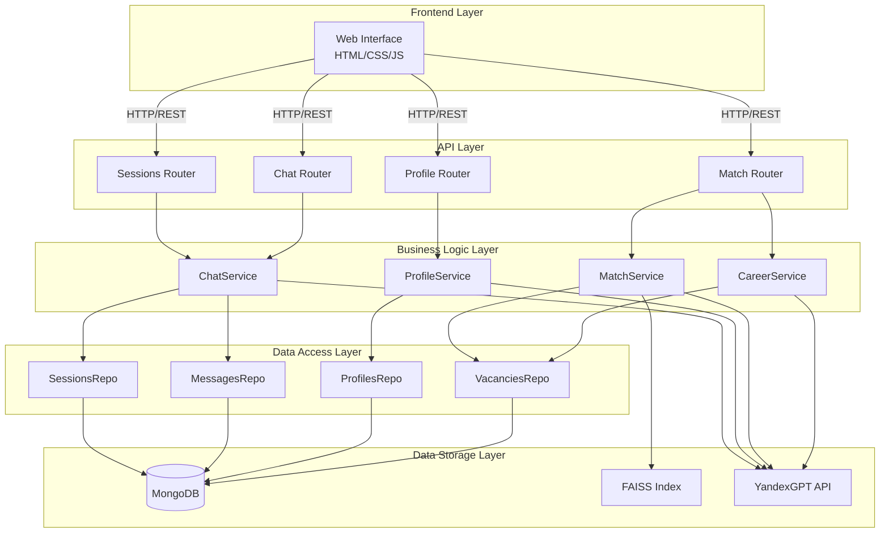
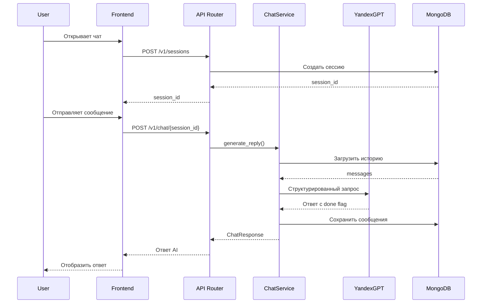
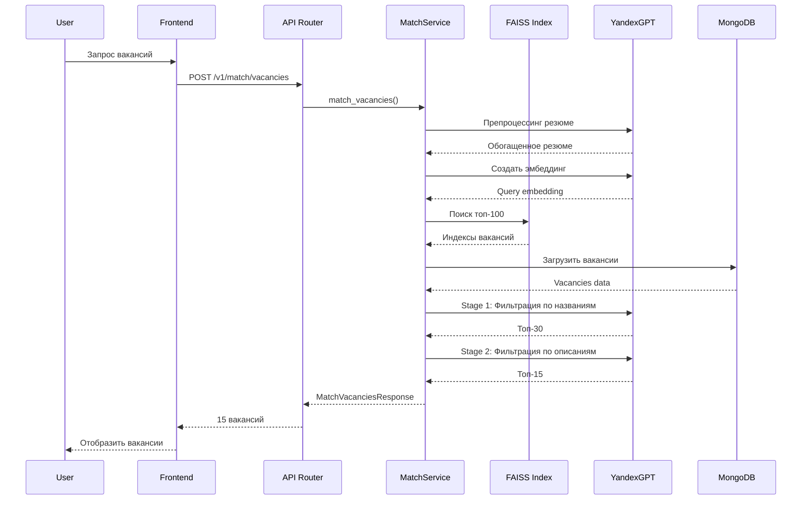
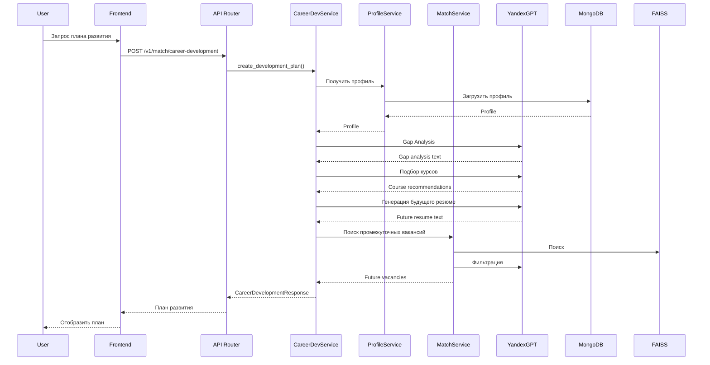

# Architecture Documentation

**Date:** 2025-01-12  
**Version:** 1.0.0

---

## 1. System Architecture Overview

Система построена по принципу многослойной архитектуры с четким разделением ответственности между слоями.

### 1.1 Архитектурные слои



---

## 2. Component Architecture

### 2.1 Frontend Components

**Single Page Application (SPA)**
- **Location:** `static/index.html`
- **Technology:** Vanilla JavaScript, HTML5, CSS3
- **Responsibilities:**
  - Отображение чата с AI
  - Управление сессиями
  - Отображение вакансий и курсов
  - Обработка пользовательского ввода

**Key Features:**
- Адаптивный дизайн (mobile-first)
- PWA поддержка
- Офлайн-работа (частично)
- Асинхронная загрузка данных

### 2.2 Backend Components

#### API Routers (`app/routers/`)

**Sessions Router**
- `POST /v1/sessions` - Создание сессии
- `GET /v1/sessions` - Список сессий пользователя
- `GET /v1/sessions/{id}` - Получение сессии с историей
- `DELETE /v1/sessions/{id}` - Удаление сессии

**Chat Router**
- `POST /v1/chat/{session_id}` - Отправка сообщения и получение ответа AI

**Profile Router**
- `GET /v1/profile/{session_id}` - Построение профиля из диалога
- `GET /v1/profile/by-user/{user_id}` - Получение профиля по user_id

**Match Router**
- `POST /v1/match/vacancies/by-session/{session_id}` - Поиск вакансий
- `POST /v1/match/career-development` - План развития карьеры

#### Services (`app/services/`)

**ChatService**
- Оркестрация диалога
- Управление состоянием интервью
- Генерация ответов через YandexGPT
- Определение завершенности интервью

**ProfileService**
- Извлечение структурированного профиля из диалога
- Валидация полноты данных
- Сохранение профиля в MongoDB

**MatchService**
- Препроцессинг резюме
- FAISS семантический поиск
- Двухэтапная LLM фильтрация
- Ранжирование результатов

**CareerDevelopmentService**
- Gap analysis (анализ разрывов)
- Подбор курсов
- Генерация "будущего резюме"
- Поиск промежуточных вакансий

#### Repositories (`app/repos/`)

**SessionsRepository**
- CRUD операции для сессий
- Поиск сессий по user_id

**MessagesRepository**
- Сохранение и загрузка сообщений
- Поиск последнего сообщения ассистента

**ProfilesRepository**
- Сохранение и загрузка профилей
- Поиск профиля по user_id

**VacanciesRepository**
- Загрузка вакансий из MongoDB
- Поиск по индексу

---

## 3. Data Flow

### 3.1 Profile Creation Flow



### 3.2 Job Matching Flow



### 3.3 Career Development Flow



---

## 4. Technology Decisions

### 4.1 Почему FastAPI?

- **Асинхронность:** Отличная поддержка async/await для работы с внешними API
- **Производительность:** Один из самых быстрых Python фреймворков
- **Автодокументация:** Автоматическая генерация OpenAPI/Swagger
- **Type hints:** Встроенная поддержка типизации

### 4.2 Почему MongoDB?

- **Гибкая схема:** Легко хранить диалоги и профили разной структуры
- **Производительность:** Быстрая запись и чтение документов
- **Масштабируемость:** Горизонтальное масштабирование через шардирование

### 4.3 Почему FAISS?

- **Скорость:** O(log n) для поиска похожих векторов
- **Масштабируемость:** Работает с миллионами векторов
- **Оптимизация:** Специально оптимизирован для векторного поиска

### 4.4 Почему YandexGPT?

- **Доступность:** Работает в России без VPN
- **Качество:** Хорошее качество на русском языке
- **Structured completion:** Поддержка JSON схем
- **Embeddings API:** Встроенный API для создания эмбеддингов

---

## 5. Deployment Architecture

### 5.1 Google Cloud Run

```
┌─────────────────────────────────────┐
│      Google Cloud Run               │
│  ┌───────────────────────────────┐ │
│  │   Docker Container            │ │
│  │  ┌─────────────────────────┐  │ │
│  │  │  FastAPI Application    │  │ │
│  │  │  - Uvicorn Server       │  │ │
│  │  │  - FAISS Index (memory) │  │ │
│  │  └─────────────────────────┘  │ │
│  └───────────────────────────────┘ │
│                                     │
│  Auto-scaling: 0-10 instances       │
│  Memory: 4Gi                        │
│  CPU: 2 cores                       │
│  Timeout: 600s                      │
└─────────────────────────────────────┘
         │
         ├──> MongoDB Atlas (Cloud)
         ├──> YandexGPT API (Cloud)
         └──> Static Files (embedded)
```

### 5.2 Startup Sequence

1. **Application Start**
   - Загрузка конфигурации
   - Валидация настроек

2. **MongoDB Connection**
   - Подключение к MongoDB Atlas
   - Создание индексов

3. **Data Seeding**
   - Проверка наличия вакансий в БД
   - Загрузка из Parquet при необходимости

4. **FAISS Index Building**
   - Загрузка эмбеддингов из файлов
   - Построение индекса (синхронно)
   - Проверка готовности

5. **Application Ready**
   - Прием HTTP запросов

---

## 6. Security Architecture

### 6.1 Security Layers

```
┌─────────────────────────────────────┐
│  Rate Limiting Middleware           │
│  (100 req/min per IP)               │
└──────────────┬──────────────────────┘
               │
┌──────────────▼──────────────────────┐
│  CORS Middleware                    │
│  (Configurable origins)              │
└──────────────┬──────────────────────┘
               │
┌──────────────▼──────────────────────┐
│  Request Validation (Pydantic)      │
│  (Input sanitization)                │
└──────────────┬──────────────────────┘
               │
┌──────────────▼──────────────────────┐
│  Business Logic                     │
└─────────────────────────────────────┘
```

### 6.2 Secrets Management

- **Environment Variables:** Все секреты в переменных окружения
- **Cloud Run Secrets:** Использование Google Secret Manager (рекомендуется)
- **No Hardcoded Secrets:** Проверка на отсутствие секретов в коде

---

## 7. Scalability Considerations

### 7.1 Current Limitations

- **FAISS Index:** Загружается в память каждого инстанса
- **No Shared Cache:** Каждый инстанс имеет свой кэш
- **Synchronous FAISS Init:** Блокирует старт приложения

### 7.2 Future Improvements

- **Distributed FAISS:** Использование Redis или специализированного сервиса
- **Shared Cache:** Redis для кэширования LLM ответов
- **Async FAISS Init:** Асинхронная загрузка индекса

---

## 8. Error Handling Strategy

### 8.1 Error Hierarchy

```
CareerCoachError (base)
├── ConfigurationError
├── YandexGPTError
├── MongoDBError
├── FAISSError
├── ProfileNotFoundError
└── SessionNotFoundError
```

### 8.2 Retry Strategy

- **External APIs:** Экспоненциальная задержка (3 попытки)
- **Database:** Retry через connection pooling
- **User-facing:** Понятные сообщения об ошибках

---

**Document Status:** ✅ Complete


