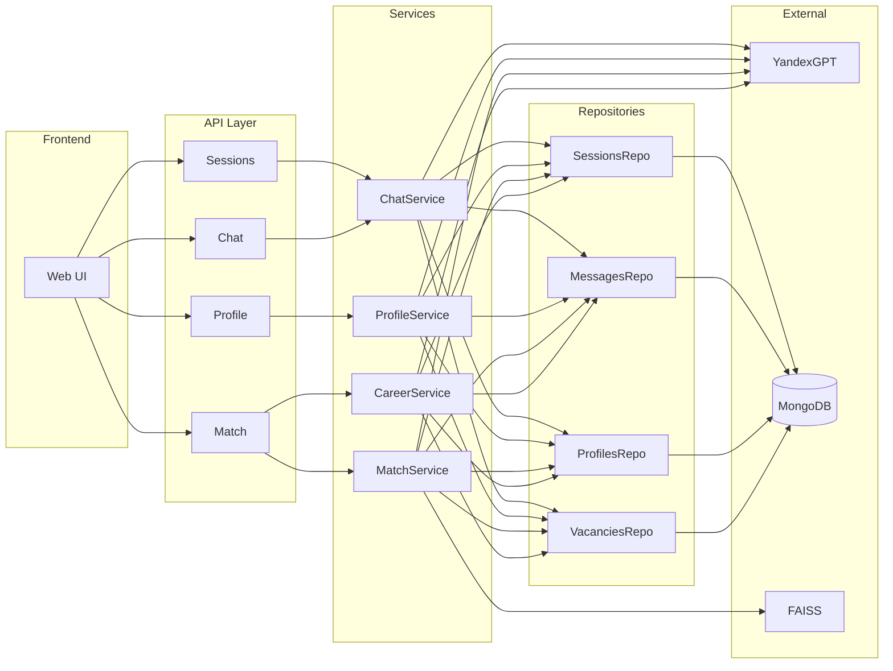

# Components Documentation

**Date:** 2025-01-12  
**Version:** 1.0.0

---

## 1. Component Overview

Система состоит из следующих основных компонентов:



---

## 2. Frontend Components

### 2.1 Web Interface (`static/index.html`)

**Назначение:** Пользовательский интерфейс системы

**Основные функции:**
- Отображение чата с AI
- Управление сессиями (создание, просмотр, удаление)
- Отображение вакансий и курсов
- Обработка пользовательского ввода

**Технологии:**
- HTML5, CSS3, Vanilla JavaScript
- Fetch API для HTTP запросов
- LocalStorage для хранения session_id

**Ключевые функции JavaScript:**
- `init()` - Инициализация приложения
- `createSession()` - Создание новой сессии
- `sendMsg()` - Отправка сообщения
- `handleProfileAction()` - Отображение профиля
- `handleVacanciesAction()` - Поиск и отображение вакансий
- `createCareerPlanFromGoals()` - Создание плана развития

---

## 3. API Layer Components

### 3.1 Sessions Router (`app/routers/sessions.py`)

**Назначение:** Управление сессиями диалогов

**Endpoints:**
- `POST /v1/sessions` - Создание новой сессии
- `GET /v1/sessions?user_id={id}` - Список сессий пользователя
- `GET /v1/sessions/{session_id}` - Получение сессии с историей
- `DELETE /v1/sessions/{session_id}` - Удаление сессии

**Зависимости:**
- `SessionsRepository` - доступ к БД
- `MessagesRepository` - загрузка истории

### 3.2 Chat Router (`app/routers/chat.py`)

**Назначение:** Обработка сообщений и генерация ответов AI

**Endpoints:**
- `POST /v1/chat/{session_id}` - Отправка сообщения и получение ответа

**Зависимости:**
- `ChatService` - бизнес-логика диалога
- `SessionsRepository` - проверка существования сессии
- `MessagesRepository` - сохранение сообщений
- `ProfilesRepository` - проверка существования профиля

### 3.3 Profile Router (`app/routers/profile.py`)

**Назначение:** Построение и получение профилей

**Endpoints:**
- `GET /v1/profile/{session_id}` - Построение профиля из диалога
- `GET /v1/profile/by-user/{user_id}` - Получение профиля по user_id

**Зависимости:**
- `ProfileService` - извлечение профиля
- `SessionsRepository` - проверка сессии
- `MessagesRepository` - загрузка истории диалога
- `ProfilesRepository` - сохранение/загрузка профиля

### 3.4 Match Router (`app/routers/match.py`)

**Назначение:** Поиск вакансий и построение карьерных планов

**Endpoints:**
- `POST /v1/match/vacancies/by-session/{session_id}` - Поиск вакансий
- `POST /v1/match/career-development` - План развития карьеры

**Зависимости:**
- `MatchService` - поиск вакансий
- `CareerDevelopmentService` - построение планов
- `ProfileService` - получение профиля
- `VacanciesRepository` - доступ к вакансиям

---

## 4. Service Layer Components

### 4.1 ChatService (`app/services/chat_service.py`)

**Назначение:** Оркестрация диалога с пользователем

**Основные методы:**
- `generate_reply()` - Генерация ответа AI на сообщение пользователя
- `build_messages_payload()` - Построение списка сообщений для LLM
- `get_response_schema()` - JSON схема для структурированного ответа
- `parse_model_output()` - Парсинг ответа от YandexGPT

**Особенности:**
- Динамический выбор промпта в зависимости от типа чата и наличия профиля
- Поддержка различных типов чатов: "Развитие карьеры", "Анализ навыков", "Анализ целей"
- Определение завершенности интервью через флаг `done`

**Зависимости:**
- `YandexGPT SDK` - вызовы LLM
- `SessionsRepository` - проверка сессии
- `MessagesRepository` - сохранение/загрузка сообщений
- `ProfilesRepository` - проверка существования профиля

### 4.2 ProfileService (`app/services/profile_service.py`)

**Назначение:** Извлечение структурированного профиля из диалога

**Основные методы:**
- `build_profile()` - Построение профиля из истории диалога
- Валидация полноты данных перед построением профиля

**Процесс:**
1. Загрузка всей истории диалога
2. Формирование промпта с требованием максимальной детализации
3. Вызов YandexGPT с JSON схемой
4. Парсинг и валидация результата
5. Сохранение в MongoDB

**Зависимости:**
- `YandexGPT SDK` - structured completion
- `MessagesRepository` - загрузка истории
- `ProfilesRepository` - сохранение профиля

### 4.3 MatchService (`app/services/match_service.py`)

**Назначение:** Многоэтапный поиск релевантных вакансий

**Основные методы:**
- `preprocess_resume()` - Обогащение резюме ключевыми словами
- `embed_query()` - Создание эмбеддинга запроса
- `stage1_select()` - Фильтрация по названиям (топ-30)
- `stage2_select()` - Фильтрация по описаниям (топ-15)
- `match_vacancies()` - Основной метод поиска

**Алгоритм:**
1. Препроцессинг резюме через LLM
2. Создание эмбеддинга запроса
3. FAISS поиск (топ-100)
4. Загрузка вакансий из БД
5. Stage 1: LLM фильтрация по названиям (30)
6. Stage 2: LLM фильтрация по описаниям (15)
7. Возврат результата

**Зависимости:**
- `FAISS` - векторный поиск
- `YandexGPT SDK` - эмбеддинги и фильтрация
- `VacanciesRepository` - загрузка вакансий

### 4.4 CareerDevelopmentService (`app/services/career_development_service.py`)

**Назначение:** Построение плана развития карьеры

**Основные методы:**
- `analyze_career_gap()` - Анализ разрывов в навыках
- `find_development_courses()` - Подбор курсов для развития
- `find_future_vacancies()` - Поиск промежуточных вакансий

**Процесс:**
1. Получение профиля пользователя
2. Gap analysis через LLM
3. Генерация рекомендаций курсов через LLM
4. Создание "будущего резюме" через LLM
5. Поиск вакансий для будущего резюме
6. Формирование ответа с планом

**Зависимости:**
- `ProfileService` - получение профиля
- `MatchService` - поиск вакансий
- `YandexGPT SDK` - анализ и генерация

### 4.5 YandexSDK (`app/services/yandex_sdk.py`)

**Назначение:** Интеграция с YandexGPT API

**Основные функции:**
- `run_text_completion()` - Простая генерация текста
- `run_structured_completion()` - Генерация с JSON схемой
- `embed_text()` - Создание эмбеддингов

**Особенности:**
- Обработка ошибок API
- Retry логика (через декоратор)
- Кэширование SDK клиента

---

## 5. Repository Layer Components

### 5.1 SessionsRepository (`app/repos/chat_repos.py`)

**Методы:**
- `find_by_id()` - Найти сессию по ID
- `insert_one()` - Создать сессию
- `update_one()` - Обновить сессию
- `list_by_user_id()` - Список сессий пользователя
- `delete_by_id()` - Удалить сессию

### 5.2 MessagesRepository (`app/repos/chat_repos.py`)

**Методы:**
- `list_by_session()` - Список сообщений сессии
- `insert_one()` - Сохранить сообщение
- `find_last_assistant_message()` - Последнее сообщение AI
- `get_all_by_session()` - Все сообщения (без лимита)
- `delete_by_session_id()` - Удалить все сообщения сессии

### 5.3 ProfilesRepository (`app/repos/profile_repos.py`)

**Методы:**
- `find_by_session_id()` - Профиль по session_id
- `find_by_user_id()` - Профиль по user_id
- `insert_one()` - Сохранить профиль
- `update_one()` - Обновить профиль

### 5.4 VacanciesRepository (`app/repos/vacancy_repos.py`)

**Методы:**
- `find_by_id()` - Вакансия по idx
- `find_by_ids()` - Несколько вакансий по индексам
- `count()` - Количество вакансий в БД

---

## 6. Infrastructure Components

### 6.1 Main Application (`app/main.py`)

**Назначение:** Точка входа приложения

**Функции:**
- Инициализация FastAPI приложения
- Настройка middleware (CORS, GZip, Rate Limiting)
- Управление жизненным циклом (lifespan)
- Подключение роутеров
- Статические файлы

**Lifespan Events:**
- **Startup:**
  1. Валидация конфигурации
  2. Подключение к MongoDB
  3. Создание индексов
  4. Загрузка вакансий (если нужно)
  5. Построение FAISS индекса
- **Shutdown:**
  1. Закрытие подключения к MongoDB

### 6.2 Configuration (`app/config.py`)

**Назначение:** Управление настройками приложения

**Класс Settings:**
- Настройки приложения (env, host, port)
- MongoDB (URI, DB name)
- YandexGPT (folder_id, api_key, iam_token)
- CORS (origins)
- Rate Limiting (requests, window)

**Методы:**
- `get_cors_origins_list()` - Список разрешенных origins
- `validate_required()` - Валидация обязательных настроек

### 6.3 Database (`app/db/mongo.py`)

**Назначение:** Подключение к MongoDB

**Функции:**
- `init_mongo()` - Инициализация подключения
- `get_db()` - Получение экземпляра БД
- `close_mongo()` - Закрытие подключения
- `ensure_indexes()` - Создание индексов
- `sanitize_mongo_doc()` - Удаление _id из документов

### 6.4 FAISS Index (`app/startup/load_embeddings.py`)

**Назначение:** Загрузка и построение FAISS индекса

**Функции:**
- `build_faiss()` - Построение индекса из файлов
- `search_top_k()` - Поиск топ-K похожих вакансий
- `get_index_stats()` - Статистика по индексу

**Процесс загрузки:**
1. Поиск директории с эмбеддингами
2. Загрузка всех `.npy` файлов
3. Объединение в один массив
4. Нормализация векторов
5. Создание HNSW индекса
6. Сохранение в глобальные переменные

---

## 7. Data Models

### 7.1 Session Models (`app/models/schemas.py`)

**Session:**
- `session_id`: str
- `user_id`: str
- `state`: SessionState

**SessionState:**
- `last_question_type`: Optional[str]
- `last_updated_at`: str

### 7.2 Message Models (`app/models/schemas.py`)

**Message:**
- `message_id`: str
- `session_id`: str
- `role`: MessageRole (user/assistant/system)
- `content`: str
- `created_at`: str
- `done`: Optional[bool]

### 7.3 Profile Models (`app/models/schemas.py`)

**UserProfile:**
- `professional_context`: ProfessionalContext
- `resume`: List[ResumeItem]
- `skills`: Skills
- `goals`: Goals
- `achievements`: List[str]

### 7.4 Match Models (`app/models/match_models.py`)

**MatchVacanciesRequest:**
- `resume`: str
- `k_faiss`: int (default: 100)
- `k_stage1`: int (default: 30)
- `k_stage2`: int (default: 15)

**MatchVacanciesResponse:**
- `result`: List[MatchedVacancy]

**MatchedVacancy:**
- `idx`: int
- `title`: str
- `company`: str
- `location`: str
- `salary`: str
- `description`: str
- `hh_url`: str
- `match_score`: float

---

## 8. External Dependencies

### 8.1 YandexGPT API

**Использование:**
- Генерация ответов в чате
- Извлечение структурированных данных (профиль)
- Препроцессинг резюме
- Фильтрация вакансий
- Создание эмбеддингов

**Endpoints:**
- Text completion
- Structured completion (JSON)
- Embeddings API

### 8.2 MongoDB Atlas

**Коллекции:**
- `sessions` - Сессии диалогов
- `messages` - Сообщения
- `profiles` - Профили пользователей
- `vacancies` - Вакансии
- `courses` - Курсы (для будущего использования)

**Индексы:**
- `sessions.user_id`
- `profiles.user_id`
- `messages.session_id + created_at`
- `vacancies.idx`

### 8.3 FAISS Index

**Тип:** HNSW (Hierarchical Navigable Small World)

**Параметры:**
- `efConstruction`: 200
- `M`: 32
- Размерность: 256 (размерность эмбеддингов YandexGPT)

**Хранение:**
- В памяти приложения
- Загружается при старте
- Глобальные переменные: `faiss_index`, `vacancy_ids`

---

## 9. Component Interactions

### 9.1 Chat Flow

```
User → Frontend → ChatRouter → ChatService → YandexGPT
                                    ↓
                              MessagesRepo → MongoDB
```

### 9.2 Profile Building Flow

```
User → Frontend → ProfileRouter → ProfileService → YandexGPT
                                            ↓
                                      MessagesRepo → MongoDB
                                            ↓
                                      ProfilesRepo → MongoDB
```

### 9.3 Vacancy Matching Flow

```
User → Frontend → MatchRouter → MatchService → FAISS
                                            ↓
                                      YandexGPT (filtering)
                                            ↓
                                      VacanciesRepo → MongoDB
```

---

## 10. Error Handling

### 10.1 Error Types

- **ConfigurationError:** Неверная конфигурация
- **YandexGPTError:** Ошибки API YandexGPT
- **MongoDBError:** Ошибки базы данных
- **FAISSError:** Ошибки FAISS индекса
- **ProfileNotFoundError:** Профиль не найден
- **SessionNotFoundError:** Сессия не найдена

### 10.2 Error Propagation

```
Service Layer → Router → Global Exception Handler → JSON Response
```

---

**Document Status:** ✅ Complete


