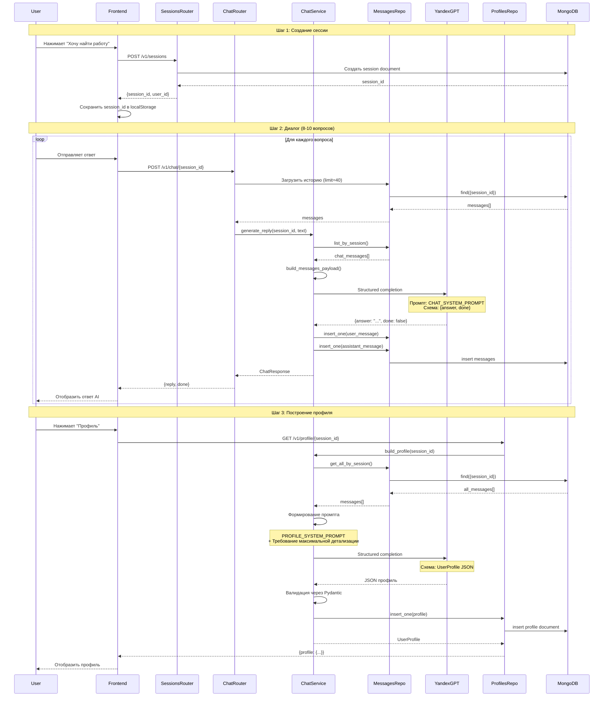
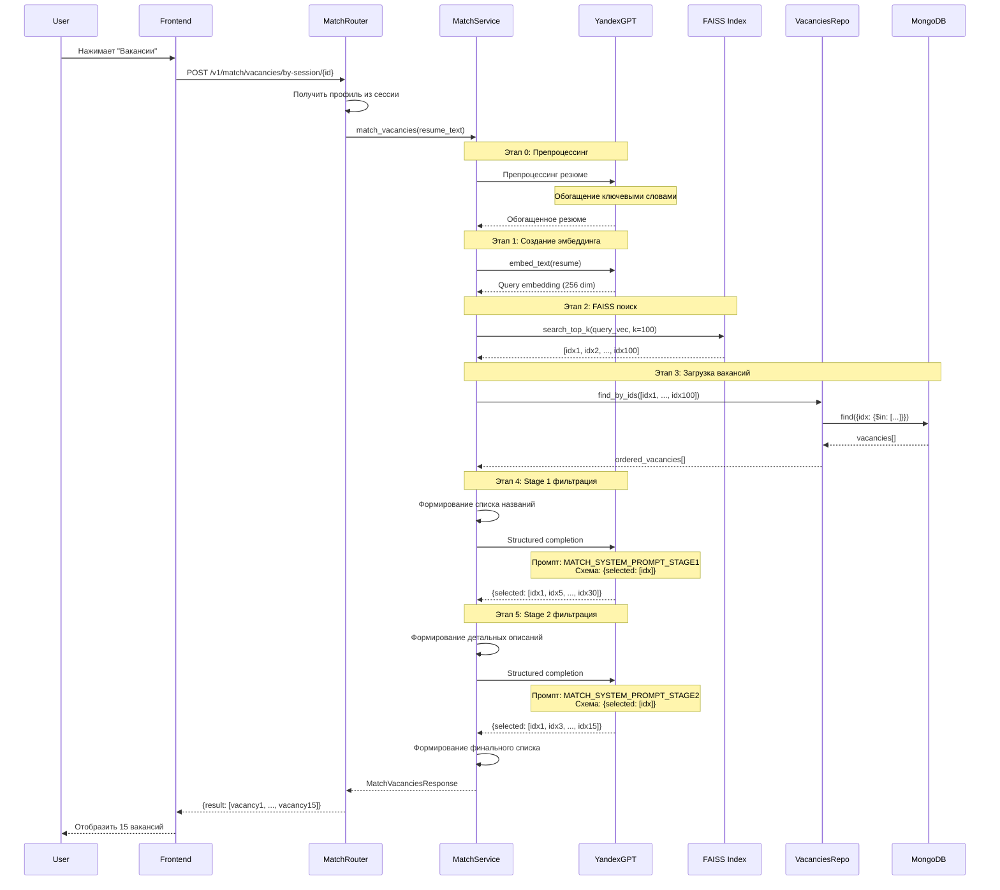
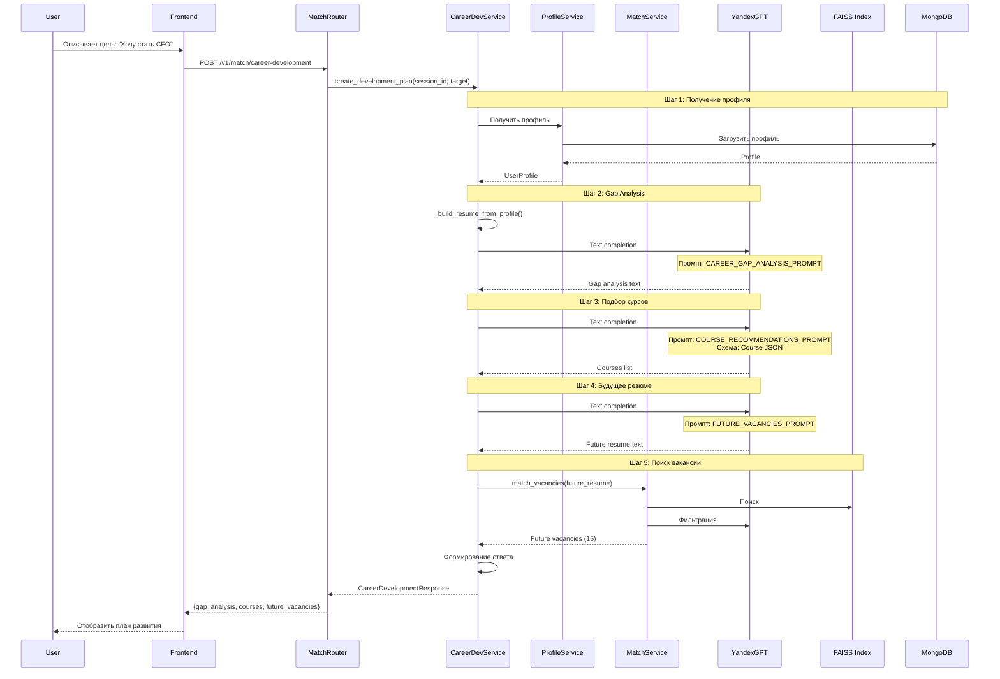
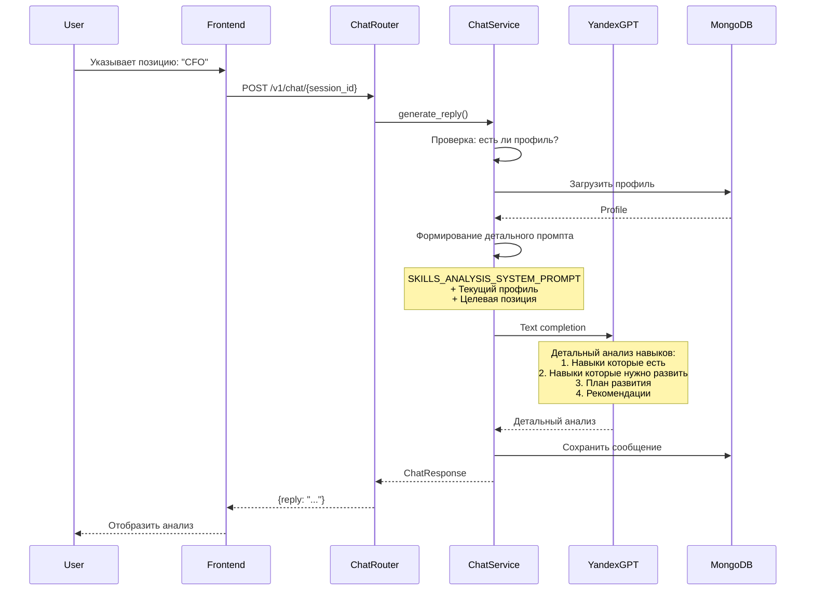
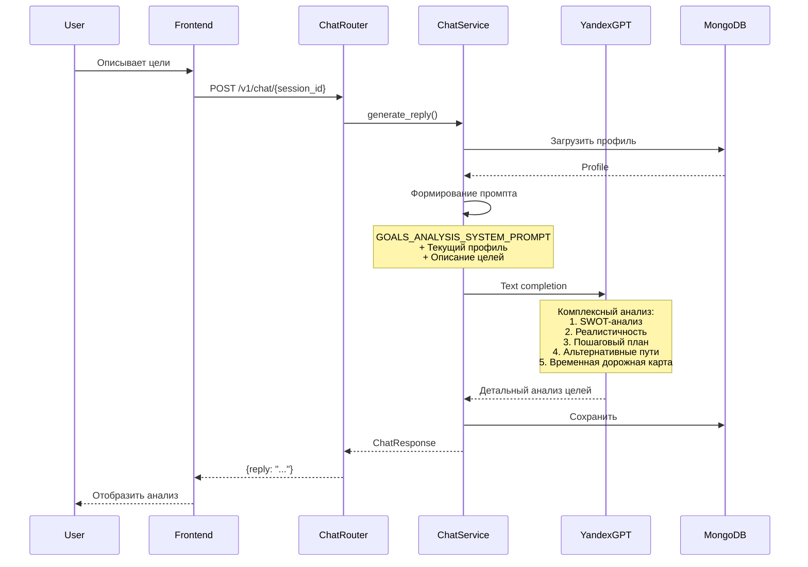
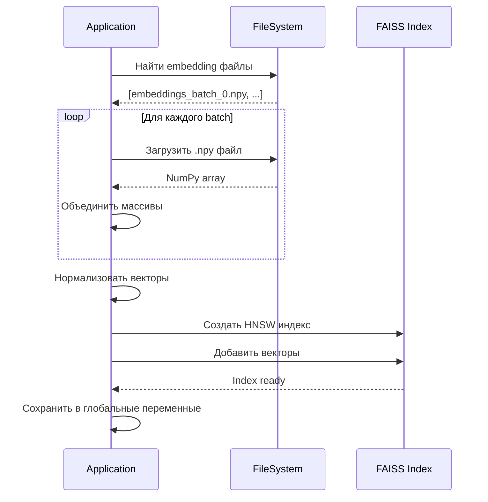
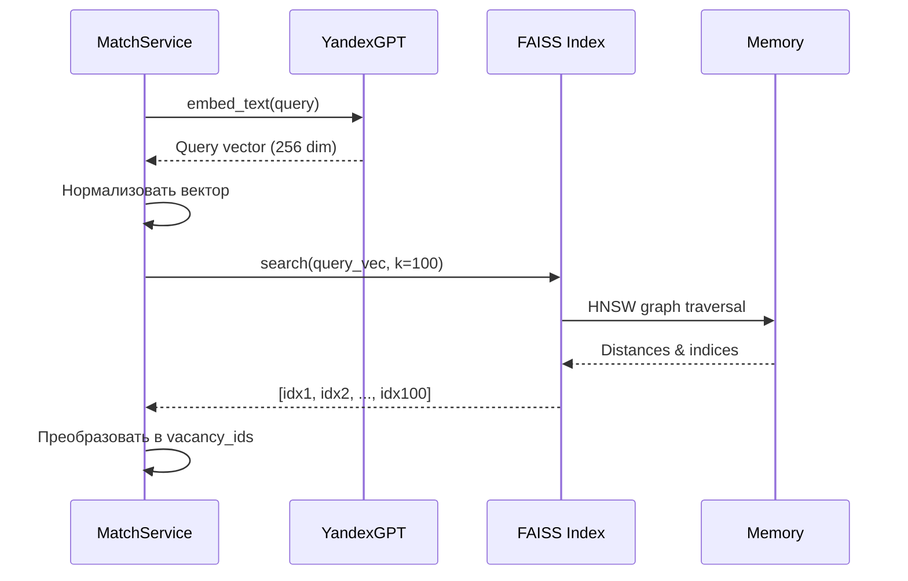
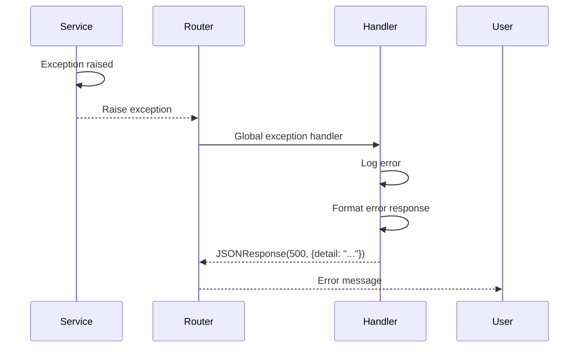

# Data Flow Documentation

**Date:** 2025-01-12  
**Version:** 1.0.0

---

## 1. Overview

Документ описывает потоки данных в системе Financial Career Coach, включая последовательности операций, преобразования данных и взаимодействия между компонентами.

---

## 2. Profile Creation Data Flow

### 2.1 Sequence Diagram



### 2.2 Data Transformations

**Input:** Свободный текст в диалоге
```
User: "Я работаю финансовым аналитиком в банке уже 5 лет. 
       Использую Excel, 1С, SAP. Прошел курсы по МСФО."
```

**Processing:**
1. Сохранение в MongoDB как есть
2. Агрегация всей истории диалога
3. Отправка в YandexGPT с промптом

**Output:** Структурированный JSON профиль
```json
{
  "professional_context": {
    "professional_role": "Финансовый аналитик",
    "professional_field": "Банки",
    "seniority_level": "middle"
  },
  "resume": [{
    "title": "Финансовый аналитик",
    "company": "Банк",
    "duration_years": 5,
    "tech_stack": ["Excel", "1С", "SAP"]
  }],
  "skills": {
    "hard_skills": ["Финансовый анализ", "МСФО"],
    "tools": ["Excel", "1С", "SAP"]
  }
}
```

---

## 3. Job Matching Data Flow

### 3.1 Sequence Diagram



### 3.2 Data Transformations

**Input:** Текст резюме из профиля
```
"Финансовый аналитик в банке, 5 лет опыта, 
Excel, 1С, SAP, курсы МСФО"
```

**Step 1: Препроцессинг**
```
"Финансовый аналитик в банковском секторе, 
5 лет опыта в финансовом анализе, 
работа с Excel (продвинутый уровень), 
1С:Бухгалтерия, SAP ERP, 
сертификаты по МСФО (Международные стандарты финансовой отчетности)"
```

**Step 2: Эмбеддинг**
```
[0.123, -0.456, 0.789, ..., 0.234] (256 dimensions)
```

**Step 3: FAISS Search**
```
Cosine similarity scores:
idx1: 0.89
idx2: 0.87
...
idx100: 0.65
```

**Step 4: LLM Filtering**
```
Stage 1: [idx1, idx5, idx12, ..., idx30] (30 вакансий)
Stage 2: [idx1, idx5, idx12, ..., idx15] (15 вакансий)
```

**Output:** Список вакансий с метаданными
```json
{
  "result": [
    {
      "idx": 1234,
      "title": "Финансовый аналитик",
      "company": "Банк ВТБ",
      "match_score": 0.89,
      "hh_url": "https://hh.ru/vacancy/1234"
    },
    ...
  ]
}
```

---

## 4. Career Development Data Flow

### 4.1 Sequence Diagram



### 4.2 Data Transformations

**Input 1:** Текущий профиль
```json
{
  "professional_context": {
    "professional_role": "Финансовый аналитик",
    "seniority_level": "middle"
  },
  "skills": {
    "hard_skills": ["Excel", "1С", "МСФО"]
  }
}
```

**Input 2:** Целевая позиция
```
"Финансовый директор (CFO)"
```

**Step 1: Gap Analysis**
```
"Для перехода на позицию CFO необходимо развить:
1. Стратегическое мышление
2. Управление командой
3. Финансовое планирование и бюджетирование
4. Работа с инвесторами
5. Знание корпоративных финансов"
```

**Step 2: Курсы**
```json
[
  {
    "name": "MBA Финансы",
    "provider": "Нетология",
    "skills": "Стратегическое планирование, управление",
    "url": "https://netology.ru/..."
  },
  ...
]
```

**Step 3: Будущее резюме**
```
"Финансовый менеджер с опытом стратегического планирования,
управления командой, работы с бюджетами.
Прошел курсы MBA Финансы, управление проектами.
Готов к переходу на позицию CFO."
```

**Step 4: Промежуточные вакансии**
```
[Вакансия: Финансовый менеджер, Вакансия: Заместитель CFO, ...]
```

**Output:** Полный план развития
```json
{
  "gap_analysis": "...",
  "courses": [...],
  "future_vacancies": [...]
}
```

---

## 5. Skills Analysis Data Flow

### 5.1 Flow Description



---

## 6. Goals Analysis Data Flow

### 6.1 Flow Description



---

## 7. Data Storage Flow

### 7.1 Write Operations


**Пример: Сохранение сообщения**
1. User отправляет сообщение
2. Router валидирует через Pydantic
3. Service обрабатывает
4. Repository вставляет в MongoDB
5. MongoDB создает индекс (если нужно)
6. Возврат подтверждения

### 7.2 Read Operations


**Пример: Загрузка истории**
1. Request с session_id
2. Repository запрос к MongoDB
3. MongoDB использует индекс `session_id + created_at`
4. Возврат отсортированных сообщений
5. Service форматирует
6. Response клиенту

---

## 8. FAISS Index Data Flow

### 8.1 Index Building (Startup)



### 8.2 Search Flow



---

## 9. Error Flow

### 9.1 Error Handling Sequence



**Error Types:**
- **ConfigurationError:** При старте приложения
- **YandexGPTError:** При вызове API
- **MongoDBError:** При операциях с БД
- **FAISSError:** При поиске

---

## 10. Caching Strategy

### 10.1 Current State

**No Caching:**
- Все запросы к YandexGPT выполняются каждый раз
- Профили загружаются из БД при каждом запросе
- FAISS индекс загружается при старте (в памяти)

### 10.2 Future Improvements

**Potential Caching:**
- Кэширование LLM ответов для одинаковых запросов
- Кэширование профилей в памяти (TTL)
- Redis для распределенного кэша

---

**Document Status:** ✅ Complete


